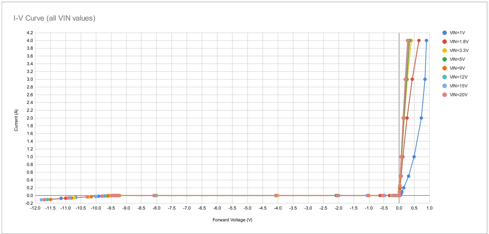
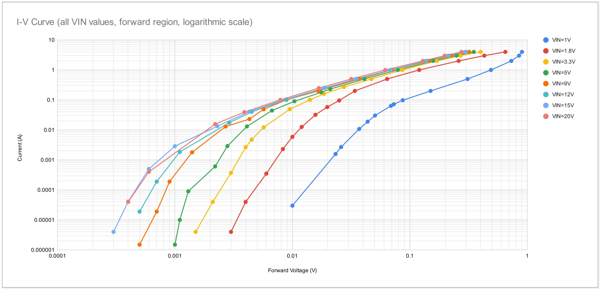
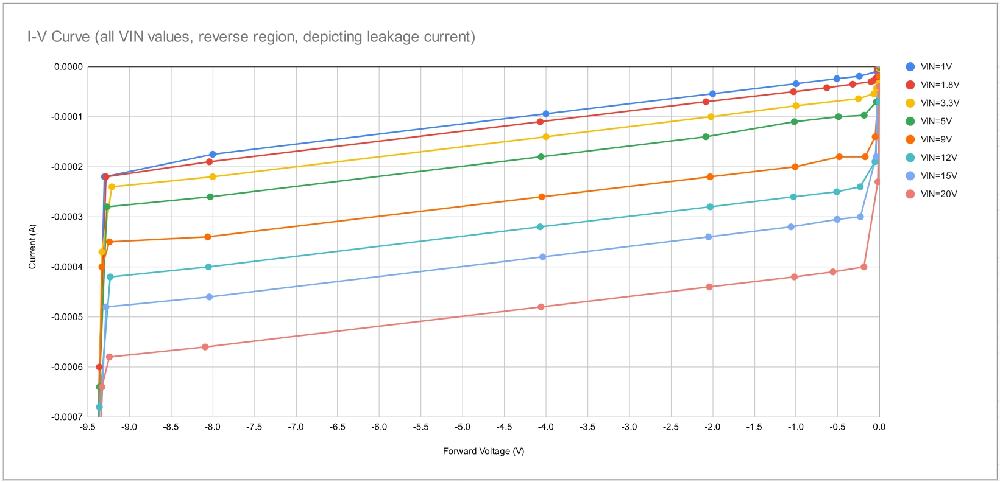
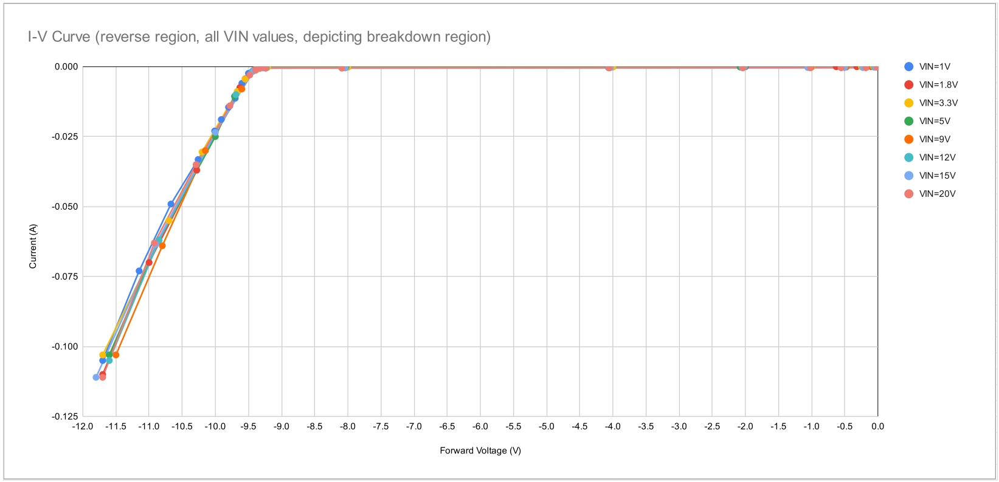
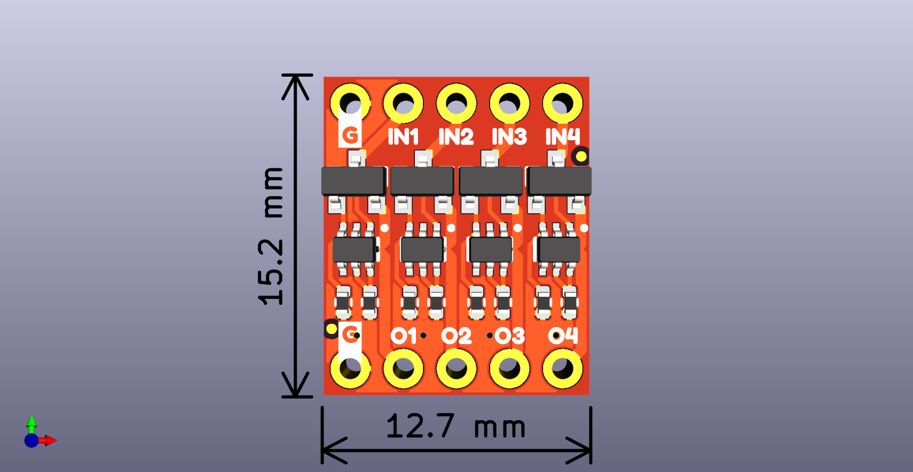

## Overview

The SparkFun Ideal Diode Breakout uses four MOSFET P-CH SOT23 chips and four transistor arrays to provide four inputs and four outputs as well as a single common ground.  

## Typical Characteristics

We've gathered some data here to give you an idea of the typical characteristics and behavior of the diodes on this breakout. 

    <table>
        <tr>
            <td style="text-align: Left; border: solid 1px #cccccc;">Max forward current: 4.2A
            </td>
            <td style="text-align: center; border: solid 1px #cccccc;">This is based on the MOSFET current rating, which depends on various factors. Higher input voltge and higher forward current result in higher gate voltage, which reduces the drain-source resistance, which reduces heat dissipation, allowing for higher current before failure of MOSFET. 4.2A continuous should be achievable with VIN=5V and 25C ambient temperature. See MOSFET dtasheet for more details.
            </td>
        </tr>
        <tr>        
            <td style="text-align: Left; border: solid 1px #cccccc;">Breakdown voltage: -9.3V
            </td>
            <td style="text-align: center; border: solid 1px #cccccc;">The base-emitter path of the BJTs is effectively a diode, which exhibits breakdown behavior with a large reverse voltage. The BJT datasheet rates this as byeond -5V, however testing shows it occurs closer to -9V. The -9.3V rating of the ideal diode circuit includes the forward voltage drop of the other BJT's base-emitter path. Larger reverse voltages can be tolerated, however this can lead to significant heat and eventually failure of the BJT, so larger reverse voltages (<-10V) should only be applied briefly.
            </td>
        </tr>
        <tr>            
            <td style="text-align: Left; border: solid 1px #cccccc;">Max input voltage: 20V
            </td>   
            <td style="text-align: center; border: solid 1px #cccccc;">The MOSFET gate is pulled down when the ideal diode circuit operates in the forward region. This behavior is analog, so a higher input voltage and higher forward current brings the gate voltage closer to GND. The MOSFET datasheet only rates the gate-source voltage at 8V max, however testing has shown it can tolerate up to 20V before immediate failure, which is the motivation for the max input voltage rating of the ideal diode circuit. Extended operation with the gate-source voltage beyond 8V may result in degradation or failure.
            </td>
        </tr>
        <tr>            
            <td style="text-align: Left; border: solid 1px #cccccc;">Min input voltage: 1V-1.8V
            </td>   
            <td style="text-align: center; border: solid 1px #cccccc;">The threshold gate-source voltage of the MOSFET is typically 0.5V-0.9V according to the datasheet. The gate can only go as low as GND, which is the motivation for the 1V minimum. However the gate does not get pulled all the way to GND, so a low input voltage (1.8V and lower) results in a higher drain-source resistance. This can result in a higher forward voltage drop, and significantly more heating of the MOSFET with high current. Extended operation at low input voltage and high current could cause the MOSFET to fail.
            </td>
        </tr>
    </table>

Some initial testing gives us the following data. We've listed some of the basics; full information, including raw data and further graphs can be [found here](https://docs.google.com/spreadsheets/d/10VnG3ES4PncXXFxEykBQ4V_JlhlVdun92eYzSfNOVCA/edit?usp=sharing).

<figure markdown>
[{ width="90%" }](../assets/img/Graph1.jpeg "Click to enlarge")
<figcaption markdown>Overall Current/Voltage Curve (Linear Scale)</figcaption>
</figure>

<figure markdown>
[{ width="90%" }](../assets/img/Graph2.jpeg "Click to enlarge")
<figcaption markdown>Positive Region (Logarithmic Scale)</figcaption>
</figure>

<figure markdown>
[{ width="90%" }](../assets/img/Graph3.jpeg "Click to enlarge")
<figcaption markdown>Leakage Current</figcaption>
</figure>

<figure markdown>
[{ width="90%" }](../assets/img/Graph4.jpeg "Click to enlarge")
<figcaption markdown>Breakdown Voltage Behavior</figcaption>
</figure>

### 3D Model

A 3D model of the board and components was exported to a STEP file using KiCad.

    <model-viewer src="../assets/3d_model/SparkFun_Ideal_Diode_Breakout_3d_model.glb" camera-controls poster="../assets/3d_model/SparkFun_Ideal_Diode_Breakout_3d_model.png" environment-image="legacy" shadow-intensity="1.58" exposure="0.64" shadow-softness="0.24" tone-mapping="neutral" camera-orbit="-46.67deg 57.14deg 153.3m" field-of-view="30deg" style="width: 750px; height: 500px;">
    </model-viewer>

 

    <a href="../assets/3d_model/SparkFun_Ideal_Diode_Breakout_3d_model.step" target="stp_file" class="md-button">Click Here for the STEP File</a>

### Board Dimensions

The board measures 15.2mm x 12.7mm. 

<figure markdown>
[{ width="50%" }](../assets/board_files/SparkFun_Ideal_Diode_Breakout_Dimensions.png "Click to enlarge")
<figcaption markdown>Board Dimensions</figcaption>
</figure>

