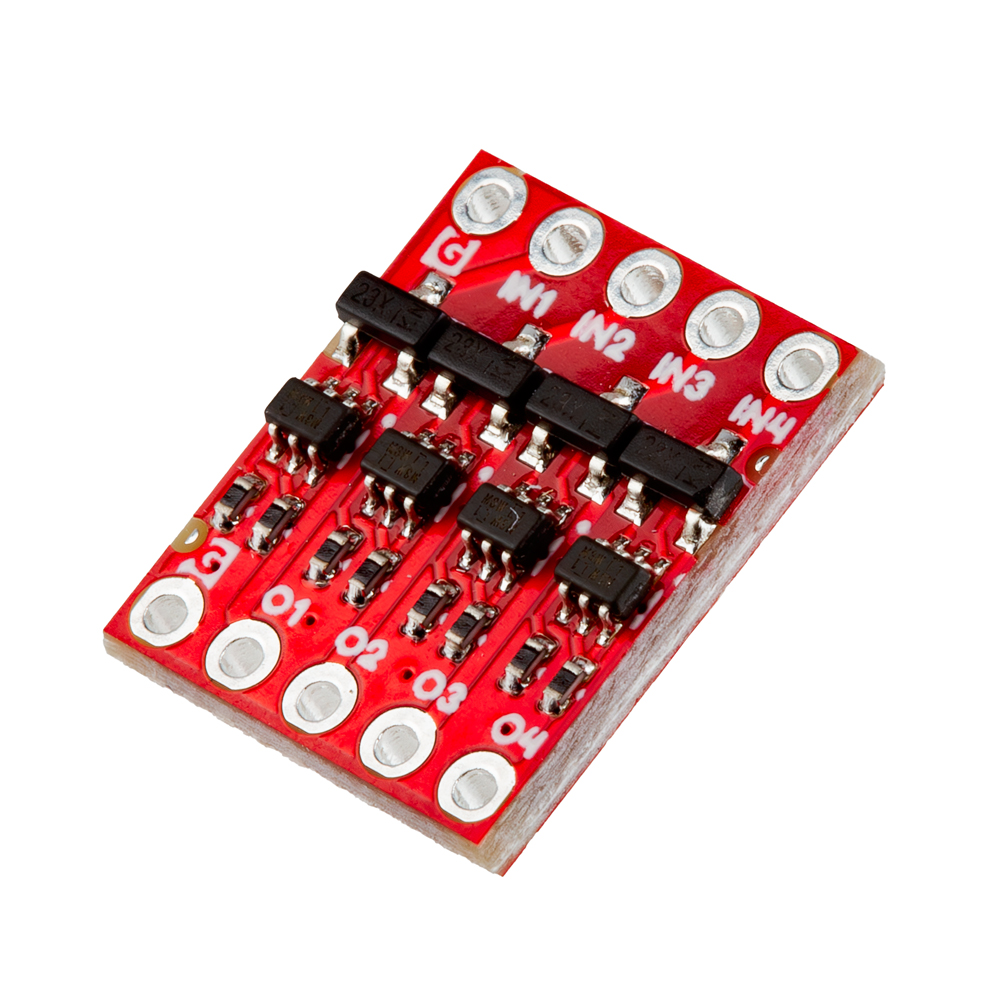
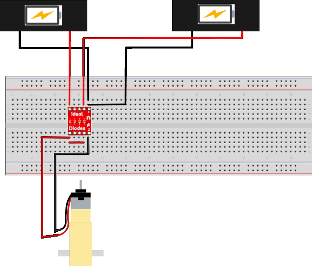

-    <a href="https://www.sparkfun.com/products/27925">
    **SparkFun Ideal Diode Breakout** 
    **SKU:** COM-27925

    ---

    <figure markdown>
    
    </figure></a>
    

-    Need some extra help keeping your project up and running while hot-swapping power supplies? The SparkFun Ideal Diode Breakout is - you guessed it - ideal. We've designed this small but mighty breakout to have four channels available as well as Ground for all your one-way voltage needs. 

    Ideal diodes are designed to control the direction of current flow and provide significant reductions in forward voltage drop, internal power dissipation, and reverse DC leakage current. This is perfect for dynamic power selection and switchover as well as over-voltage protection and projects that require consistent power input. 

    

    [Purchase from SparkFun :fontawesome-solid-cart-plus:{ .heart }](https://www.sparkfun.com/products/27925){ .md-button .md-button--primary }
    

## Getting Started 

The SparkFun Ideal Diode Breakout is the perfect addition to your project if you need to avoid a large voltage drop across a circuit. There is no minimum threshold voltage required and no internal resistance. It is also incredibly useful for swapping power supplies in situ 

## Hooking Up the Breakout

Hooking up the SparkFun Ideal Diode Breakout is fairly straightforward. Power inputs go through two separate input circuits but have a common ground. Have a look at this quick example: 

<figure markdown>
[{ width="90%" }](../assets/img/hookup.png "Click to enlarge")
<figcaption markdown>Hot Swapping a Power Supply to a RedBoard</figcaption>
</figure>
